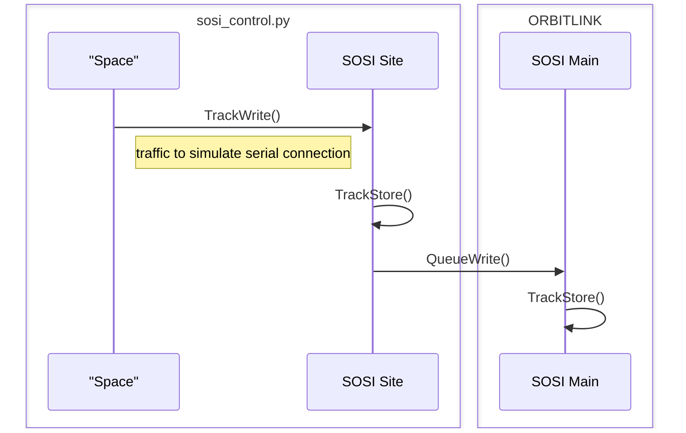
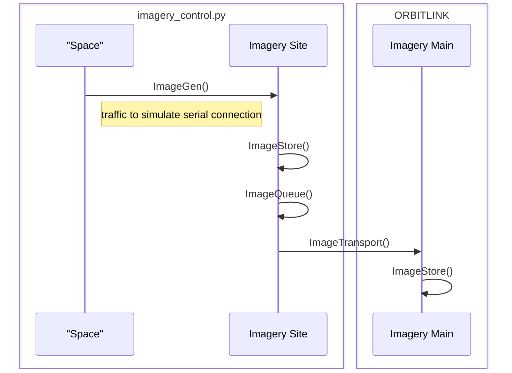
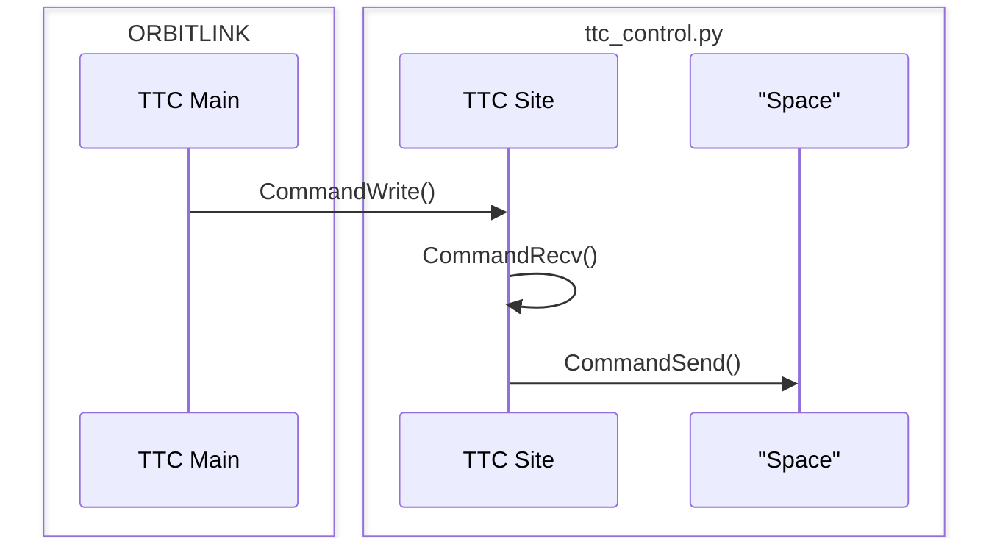

# OrbitLink
Suite of applications to simulate a satellite control network

## OrbitLink Web Gateway
Python Flask web front-end which displays information from the OrbitLink suite

### Pages
- `/` displays index.html which holds 3 iframes for `/sosi`, `/ttc`, and `/imagery`
- `/sosi` displays the .json file named `data/sosi_store.tle` which holds all received SOSI communications and sorts the output in descending order based on timestamp
- `/ttc` displays the .json file named `data/ttc.json` which holds a log of all TTC commands send to the specified host and sorts the output in descending order based on timestamps in the `[time_data]` and `[mode_data]` fields respectively
  - Note: This page does not accurately display connectivity with the remote host, only that data is being successfully sent.
- `/imagery` renders the most recently received image file in the `images` directory
  - Note: The image byte code is sent in base64 encoded strings, to generate those strings you can use the following python code:
  ```python
  #Write images to base64 string where images is a list of image byte code
    for i, image_string in enumerate(images):
        remainder = len(image_string) % 4
        if remainder != 0:
            image_string += '=' * (4 - remainder)
        image_data = base64.b64decode(image_string)
        output_path = 'resources/con_image{}.png'.format(i+1)
        with open(output_path, "wb") as binary_image:
            binary_image.write(image_data)
  ```
### Usage
- `-ttc` specifies the IP of the destination host running the ttc_control.py application  
- `--headless` runs just the flask web server without all the listeners/senders

## OrbitLink Controls
SOSI Data Forwarder (sender), TT&C Command Forwarder (receiver), and Imagery Forwarder (sender) Applications

### Usage
- OrbitLink Controls  
`sosi.exe sosi_control -dst orbitlink_ip`  
`imagery.exe imagery_control -dst orbitlink_ip`  
`ttc.exe ttc_control`  

- All python (in the control programs) has been written in order to be compatible with version 3.4

### Usage
- OrbitLink  
`python.exe app.py -ttc ttc_host_ip`  

## Technical Walkthrough
### Sequence Diagrams
**SOSI**  
`(CONTROL) TrackWrite(): Write random tracks to localhost on port 7073`  

`(CONTROL) TrackStore(): Write received tracks to queue/database "sosi_store.tle" (.txt masked .tle file)`  

`(CONTROL) QueueWrite(): Leave at least 5 entries in sosi_store.tle and send to the rest to specified host (OrbitLink) on port 8067`  

`(ORBITLINK) TrackStore(): Receives tracks on port 7074 and writes to "data/sosi_store.tle"`


**Imagery**  
`(CONTROL) ImageGen(): Write image byte code to localhost on port 6960 to simulate data coming from 'Space'`  

`(CONTROL) ImageStore(): Listen on port 6960 for image byte code and generate between 1-7 image files (randomly) from received byte code then write to specified folder`  

`(CONTROL) ImageQueue(): Read specified folder and write newest between 1-3 (randomly) number of files to image_queue.txt`  

`(CONTROL) ImageTransport(): Read image_queue.txt, send all entries to specified host on port 8069, then delete specified entries from 'images\image_queue.txt' `  

`(ORBITLINK) ImageStore(): Listen on all available network interfaces on port 8069 for image files. If more than 5 image files are in the directory, add the filenames to 'images/recv_imagery.log' and then delete the files`


**TTC**  
`(ORBITLINK) CommandWrite(): Send 'science mode updates' every 1-5 minutes (randomly) and 'correlated time status updates' every 2 minutes to specified host (-ttc switch) on port 7474`  

`(CONTROL)CommandRecv(): Receive commands on port 7474 and store in 'ttc_command_queue.log'`   

`(CONTROL) CommandWrite(): Send random 'science mode updates' every 1-5 minutes (randomly) and random 'correlated time status updates' every 2 minutes to an invalid host (simulate space) on port 7474`  

    Note: CommandWrite() is not dependent on OrbitLink functioning properly, the 'ttc_command_queue.log' is the only indicator



## Setup
### OrbitLink
Python Flask app which displays information received in .json data stores

### SOSI Site
Manual Setup:

    Install python 3.4.4
    Copy python.exe from %INSTALLROOT% to C:\SOSI\sosi.exe
    Copy sosi_control.py to C:\SOSI
    Rename sosi_control.py to sosi_control
    Run 'Site Command'
        
Site Command:  
`cd C:\SOSI`  
`sosi.exe sosi_control -dst dst_ip`

### Imagery Site
Manual Setup:

    Install python 3.4.4
    Copy python.exe from %INSTALLROOT% to C:\IMAGERY\imagery.exe
    Copy imagery_control.py to C:\IMAGERY
    Rename imagery_control.py to imagery_control
    Run 'Site Command'
        
Site Command:  
`cd C:\IMAGERY`  
`imagery.exe imagery_control -dst dst_ip`
### TTC Site
Manual Setup:

    Install python 3.4.4
    Copy python.exe from %INSTALLROOT% to C:\TTC\ttc.exe
    Copy ttc_control.py to C:\TTC
    Rename ttc_control.py to ttc_control
    Run 'Site Command'
        
Site Commands:  
`cd C:\TTC`  
`ttc.exe ttc_control`

## Deployment
### Using VMware, ESXI and PowerCLI
#### 1. Install Python on Site Hosts
Connect to the ESXI server
```powershell
Connect-VIServer -Server <ESXi_Hostname_or_IP> -User <username> -Password <password>
```
1. Upload the Python 3.4 Installer to the VM's Datastore: 
```powershell
$datastore = "your_datastore_name"
$localInstallerPath = "C:\path\to\python-3.4.msi"
$remoteInstallerPath = "/vmfs/volumes/$datastore/python-3.4.msi"

Set-VMHostDatastore -VMHost <ESXi_Hostname_or_IP> -Name $datastore | New-DatastoreItem -Path $remoteInstallerPath -ItemType File -SourcePath $localInstallerPath
```
2. Install Python on the VM using PowerCLI  
```powershell
$vmName = "Your_VM_Name"

# The path on the VM where the installer was uploaded
$vmInstallerPath = "C:\python-3.4.msi"

# Command to execute the installer
$installCmd = "msiexec.exe /i $vmInstallerPath /qb"

# Execute the command on the VM
Invoke-VMScript -VM $vmName -ScriptText $installCmd -GuestUser "windows_username" -GuestPassword "windows_password"
```
3. Clean Up (Optional)
```powershell
Remove-DatastoreItem -Item $remoteInstallerPath -Confirm:$false
```
#### 2. Prepare Site Hosts as Imagery/SOSI/TTC
Connect to the ESXI server
```powershell
Connect-VIServer -Server <ESXi_Hostname_or_IP> -User <username> -Password <password>
```
1. Create application directory on the VM (replace `APP`, `Your_VM_Name`, `windows_username` and `windows_password`)
```powershell
$vmName = "Your_VM_Name"

# Command to create directory
$mkdirCmd = "mkdir C:\APP"

# Execute the command on the VM
Invoke-VMScript -VM $vmName -ScriptText $mkdirCmd -GuestUser "windows_username" -GuestPassword "windows_password"
```
2. Copy python.exe from C:\Python34 to application directory (replace `APP`, `windows_username` and `windows_password`)
```powershell
$copyCmd = "Copy-Item -Path C:\Python34\python.exe -Destination C:\APP\APP.exe"

# Execute the copy command on the VM
Invoke-VMScript -VM $vmName -ScriptText $copyCmd -GuestUser "windows_username" -GuestPassword "windows_password"
```
3. Copy APP_control.py from Local Host to VM's C:\APP (replace `APP`, `path_on_host`, `windows_username` and `windows_password`)
```powershell
$localFilePath = "C:\path_on_host\APP_control.py"
$vmFilePath = "C:\TTC\APP_control.py"

# Copy file to the VM
Copy-VMGuestFile -Source $localFilePath -Destination $vmFilePath -VM $vmName -LocalToGuest -GuestUser "windows_username" -GuestPassword "windows_password"
```
4. Rename APP_control.py to APP_control on the VM (replace `APP`, `windows_username` and `windows_password`)
```powershell
$renameCmd = "Rename-Item -Path C:\APP\APP_control.py -NewName C:\APP\APP_control"

# Execute the rename command on the VM
Invoke-VMScript -VM $vmName -ScriptText $renameCmd -GuestUser "windows_username" -GuestPassword "windows_password"
```
#### 3. Start Orbitlink
1. On main host (replace `ttc_host`)
```shell
cd orbitlink\orbitlink
python.exe app.py -ttc ttc_host
```
#### 4. Start Site Applications
1. On site hosts (replace APP)
```shell
cd C:\APP
APP.exe APP_control
```
## Red Team
- Below is a suggested methodology for breaking the functionalities of this application suite (other than the less than obvious killing processes)

## Resources
### SOSI
- Included some sample data taken from [Space-Track.org](space-track.org/#recent) which shows every element (ELSET) published on the indicated Julian date, prepended by the year.  
- Also included is a list of LEO, GEO, MEO, and HEO objects indicated by filename. Note, the specific orbit data is in a "3LE" three line element which indicates the name of the space object, followed by the TLE. This data is for every object in the specified group that has received an update within the past 30 days. (CAO: 20230723)

### TTC
- TT&C Academic Resource: [White Paper](https://link.springer.com/referenceworkentry/10.1007/978-1-4419-7671-0_69)
- [SpaceTrack API](https://www.space-track.org/documentation#api-formats)
- [Utah State University White Paper on Satellite Telemetry](https://digitalcommons.usu.edu/cgi/viewcontent.cgi?article=8846&context=etd) section 2.2 has a table that shows the data used for measuring telemetry and could be used to make TT&C more realistic, section 3.1.3 shows the science packet breakdown, section 3.2.2 shows an overview of the overall TT&C packet
- [MIT Course List on Satellite Engineering](https://ocw.mit.edu/courses/16-851-satellite-engineering-fall-2003/pages/lecture-notes/)
- [MIT PDF on Satellite Communications](https://ocw.mit.edu/courses/16-851-satellite-engineering-fall-2003/resources/l21satelitecomm2_done/) has some good information on link equations
- [MIT PDF on Satellite Engineering](https://ocw.mit.edu/courses/16-851-satellite-engineering-fall-2003/resources/l20_satellitettc/) has a high level overview of the communications

### Imagery
- Included sample images (mostly hotdog related), and their base64 strings named accordingly
