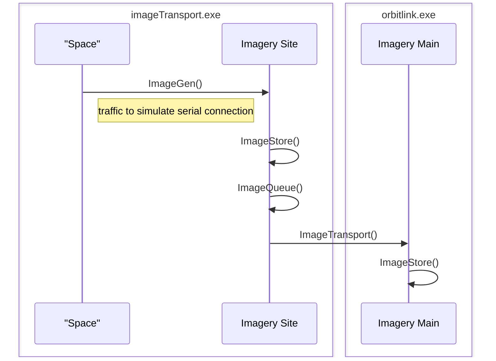
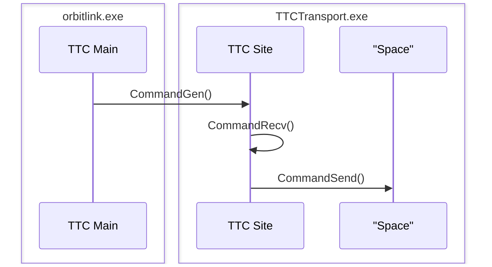

# OrbitLink
Suite of applications to simulate a satellite control network

## OrbitLink Control
SOSI Data Receiver and TT&C Command Transfer Application

### Usage
python ol_control_send.py 192.168.0.47 192.168.0.47 12345 SOSI

## OrbitLink Data Vault
SOSI and TT&C Data Storage Application

## OrbitLink Web Gateway
Web Front-End Application

## Resources
- Included some sample data taken from [Space-Track.org](space-track.org/#recent) which shows every element (ELSET) published on the indicated Julian date, prepended by the year.  
- Also included is a list of LEO, GEO, MEO, and HEO objects indicated by filename. Note, the specific orbit data is in a "3LE" three line element which indicates the name of the space object, followed by the TLE. This data is for every object in the specified group that has received an update within the past 30 days. (CAO: 20230723)
- TT&C Academic Resource: [White Paper](https://link.springer.com/referenceworkentry/10.1007/978-1-4419-7671-0_69)
- [SpaceTrack API](https://www.space-track.org/documentation#api-formats)
- [Utah State University White Paper on Satellite Telemetry](https://digitalcommons.usu.edu/cgi/viewcontent.cgi?article=8846&context=etd) section 2.2 has a table that shows the data used for measuring telemetry and could be used to make TT&C more realistic, section 3.1.3 shows the science packet breakdown, section 3.2.2 shows an overview of the overall TT&C packet

## Technical Walkthrough
### Sequence Diagrams
**SOSI**  
`TrackWrite(): Write random tracks to specified host (Site Host) on port 7073`  
`TrackStore(): Write tracks to queue/database "sosi_store.tle" (.txt masked .tle file)`  
`QueueWrite(): Read top XX number of entries from sosi_store.tle and send to specified host on port 8067`  


**Imagery**  
`ImageGen(): Write image byte code to specified host on port 6960` 
`ImageStore(): Generate image files from byte code and write to specified folder`  
`ImageQueue(): Read specified folder and write newest XX number of files to image_queue.txt`  
`ImageTransport(): Read image_queue.txt, copy then delete all entries, send all specified files to specified host on port 8069`  
`ImageStore(): Write all received images to specified folder and create an entry in "imageStore.json"`


**TTC**  
`CommandGen(): Send random commands to specified host on port 7474`  
`CommandRecv(): Receive commands and write to queue "commandStore.json"`
`CommandSend(): Read newest commands from commandStore.json and send to specified host (an invalid IP) on port 7474 (UDP)`


## Setup
### SOSI 
#### SOSI Site
    Win XP Setup:
        Install python 3.4.4
        Copy python.exe from %INSTALLROOT% to C:\SOSI\sosi.exe
        Copy sosi_control.py to C:\SOSI
        Rename sosi_control.py to sosi_control
        Run sosi_site.bat
        
Site Command: `sosi.exe sosi_control --site --destination:10.10.32.60:8067 --interval=60`

#### SOSI Batch File
```shell
sleep 60
sosi.exe sosi_control --main
sleep 60
```
### Imagery 

#### Imagery Site

#### Sequence Diagram


### TTC 

#### TTC Site

#### Sequence Diagram


### Main Orbit Link

Python Flask app which displays information received in .json data stores