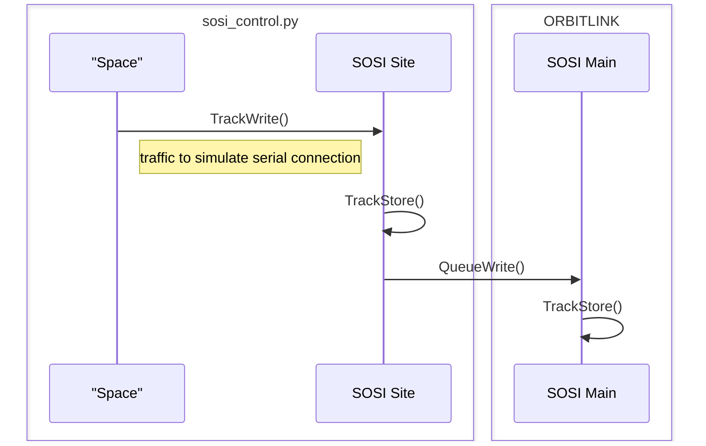
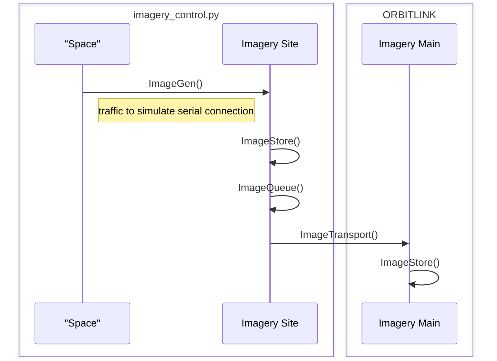
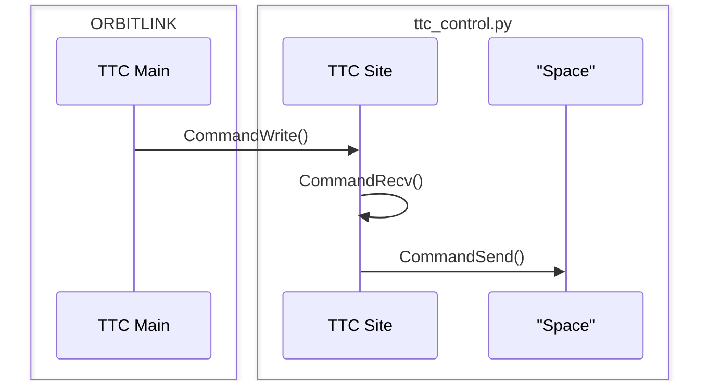

# OrbitLink Controls
**SOSI**  
`(CONTROL) TrackWrite(): Write random tracks to localhost on port 7073`  

`(CONTROL) TrackStore(): Write received tracks to queue/database "sosi_store.tle" (.txt masked .tle file)`  

`(CONTROL) QueueWrite(): Leave at least 5 entries in sosi_store.tle and send to the rest to specified host (OrbitLink) on port 8067`  

`(ORBITLINK) TrackStore(): Receives tracks on port 7074 and writes to "data/sosi_store.tle"`

**Imagery**  
`(CONTROL) ImageGen(): Write image byte code to localhost on port 6960 to simulate data coming from 'Space'`  

`(CONTROL) ImageStore(): Listen on port 6960 for image byte code and generate between 1-7 image files (randomly) from received byte code then write to specified folder`  

`(CONTROL) ImageQueue(): Read specified folder and write newest between 1-3 (randomly) number of files to image_queue.txt`  

`(CONTROL) ImageTransport(): Read image_queue.txt, send all entries to specified host on port 8069, then delete specified entries from 'images\image_queue.txt' `  

`(ORBITLINK) ImageStore(): Listen on all available network interfaces on port 8069 for image files. If more than 5 image files are in the directory, add the filenames to 'images/recv_imagery.log' and then delete the files`

**TTC**  
`(ORBITLINK) CommandWrite(): Send 'science mode updates' every 1-5 minutes (randomly) and 'correlated time status updates' every 2 minutes to specified host (-ttc switch) on port 7474`  

`(CONTROL)CommandRecv(): Receive commands on port 7474 and store in 'ttc_command_queue.log'`   

`(CONTROL) CommandWrite(): Send random 'science mode updates' every 1-5 minutes (randomly) and random 'correlated time status updates' every 2 minutes to an invalid host (simulate space) on port 7474`  

    Note: CommandWrite() is not dependent on OrbitLink functioning properly, the 'ttc_command_queue.log' is the only indicator

